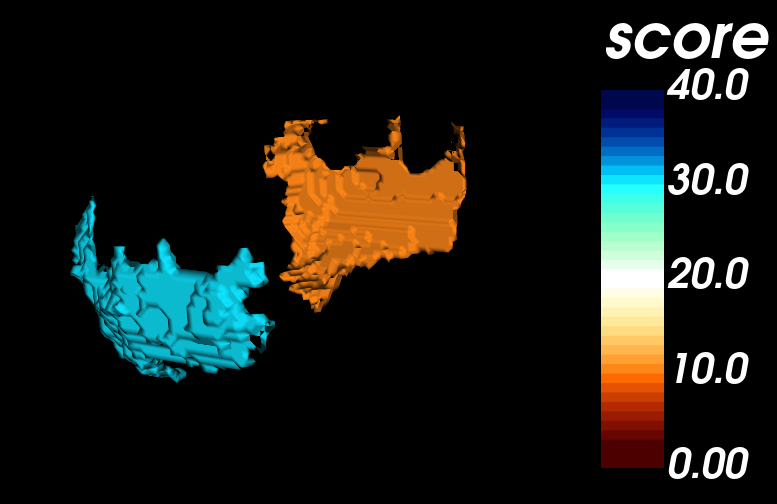
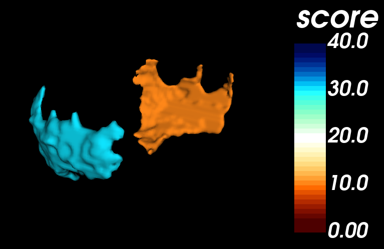

# 3D brain plot
Create three-dimensional plot of scores on the brain surface. 

 
3D brain plots of the left hemisphere of a neonatal brain with random scores. The figure shows the brain of a neonatal subject of the developing Human Connectome Project [DHCP](http://www.developingconnectome.org/) [[1]](#1) [[2]](#2).

## Idea
Illustrating scores and regions of interest on the brain surface is a helpful tool to present scientific findings. Several tools approach the task. However, they are often based on specific brain atlases or standard surfaces. This manual is independent from standardized brains. In fact, the code is not even limited to brains.

## How to create a plot
To generate a surface plot, there are two main steps:
1. Mask preparation
2. Model generation

### 1. Mask preparation
The mask contains the object you want to plot. It equals a three-dimensional matrix with zero for background voxels and other values for the components of the object. The other values equal the scores or labels which should be encoded by colors in the plot. To gain such a file, each label of a specific brain segmentation can be replaced by the corresponding score. Take into consideration that the scores should be uneven to zero to differ between background and object. 
Based on this data file, there are different ways to gain a surface file (.vtk):

1. The [plot_nifti.py](./plot_nifti.py) code takes a nifti-file (.nii or .nii.gz) as input and transforms it into a vtk-file. No further preparation is needed. The surface looks medium smooth.
2. Another option, to gain a very smooth surface is using [ITK-SNAP](http://www.itksnap.org/) [[3]](#3). When the mask is opened as a segmentation in ITK-SNAP (version 3.6.0), go to the menu "Segmentation", choose "Export as Surface Mesh...", select the option "Export meshes for all labels as single scene", click "Next>", choose a file name and a folder and click "Finish" to save the VTK-PolyData-File.

### 2. Model generation
The code builds on the open source Visualization Toolkit [(VTK)](https://vtk.org/). Depending on which option you choose in step 1, there is one plotting code for each option:
1. [plot_nifti.py](./plot_nifti.py) for plotting surfaces based on a nifti-file. The following requirements are needed: Python 3.8.10 and the python libraries colorsys, vtk, and SimpleITK.
2. [plot_vtk.py](./plot_vtk.py) for plotting surfaces of a VTK-PolyData-File. The following requirements are needed: Python 3.8.10 and the python libraries colorsys and vtk.

By default, an interactive 3D visualization starts and shows the generated model.

These variables can be defined in the code:
- By default, the colorbar will appear in the plot. This can be disabled.
- The range of the colorbar which defines the colors for each value can be adapted by `min_val` and `max_val`. Limitations of the colorbar function are explained in the code.
- There are two implementations for colorbars ([lookuptable.py](./lookuptable.py)). By default, the values are encoded from red to yellow to white to green to blue (1). The second option is from darkred to lightred to white to lightblue to darkblue (2). Feel free to adjust the colors like you want.

- The camera position can be specified by `camera.SetPosition` and `camera.SetRoll`. This part can be uncommented in the code.
- By default, an interactive window shows the model. Optionally, an automatic screenshot of the plot can be saved in the [plots-folder](./plots/) if `save_mode` is set to `True`.

### Run an example
To get an idea of the visualization, an example file is provided in the [masks-folder](./masks/). We can not publish whole brain scans because of data privacy. Instead, a nifti-file of a manual right and left neonatal claustrum mask of a subject of the developing Human Connectome Project [DHCP](http://www.developingconnectome.org/) [[1]](#1) [[2]](#2) is supplied with random exemplary scores. The claustrum is a small gray matter structure in the brain. The width of the claustrum in voxels is in the range of singel digits. Thereby, the model quality and smoothness can be assessed.  

1. Install the requirements: The code runs with Python 3.8.10. These python libraries are used: colorsys, vtk, and SimpleITK for [plot_nifti.py](./plot_nifti.py). 
2. Run [plot_nifti.py](./plot_nifti.py). An interactive window should open after a couple of seconds. 
  
3. Alternatively, run [plot_vtk.py](./plot_vtk.py). Again, an interactive window should open after a couple of seconds. 
  

## Disclaimer on datasets
Developing Human Connectome Project data can be obtained on the project's website ([DHCP](http://www.developingconnectome.org/)).

## Acknowledgement
Neonatal data were provided by the developing Human Connectome Project, KCL-Imperial-Oxford Consortium funded by the European Research Council under the European Union Seventh Framework Programme (FP/2007-2013) / ERC Grant Agreement no. (319456). We are grateful to the families who generously supported this trial.

## References
<a id="1">[1]</a> Hughes, E.J., Winchman, T., Padormo, F., Teixeira, R., Wurie, J., Sharma, M., Fox, M., Hutter, J., Cordero‐Grande, L., Price, A.N., Allsop, J., Bueno‐Conde, J., Tusor, N., Arichi, T., Edwards, A.D., Rutherford, M.A., Counsell, S.J., Hajnal, J.V., 2017. A dedicated neonatal brain imaging system. Magn. Reson. Med. 78, 794–804. https://doi.org/10.1002/mrm.26462 
<a id="2">[2]</a> Makropoulos, A., Robinson, E.C., Schuh, A., Wright, R., Fitzgibbon, S., Bozek, J., Counsell, S.J., Steinweg, J., Vecchiato, K., Passerat-Palmbach, J., Lenz, G., Mortari, F., Tenev, T., Duff, E.P., Bastiani, M., Cordero-Grande, L., Hughes, E., Tusor, N., Tournier, J.-D., Hutter, J., Price, A.N., Teixeira, R.P.A.G., Murgasova, M., Victor, S., Kelly, C., Rutherford, M.A., Smith, S.M., Edwards, A.D., Hajnal, J.V., Jenkinson, M., Rueckert, D., 2018. The developing human connectome project: A minimal processing pipeline for neonatal cortical surface reconstruction. NeuroImage 173, 88–112. https://doi.org/10.1016/j.neuroimage.2018.01.054 
<a id="3">[3]</a> Yushkevich PA, Piven J, Hazlett HC, Smith RG, Ho S, Gee JC, Gerig G. User-guided 3D active contour segmentation of anatomical structures: significantly improved efficiency and reliability. Neuroimage. 2006;31:1116-28.
 
